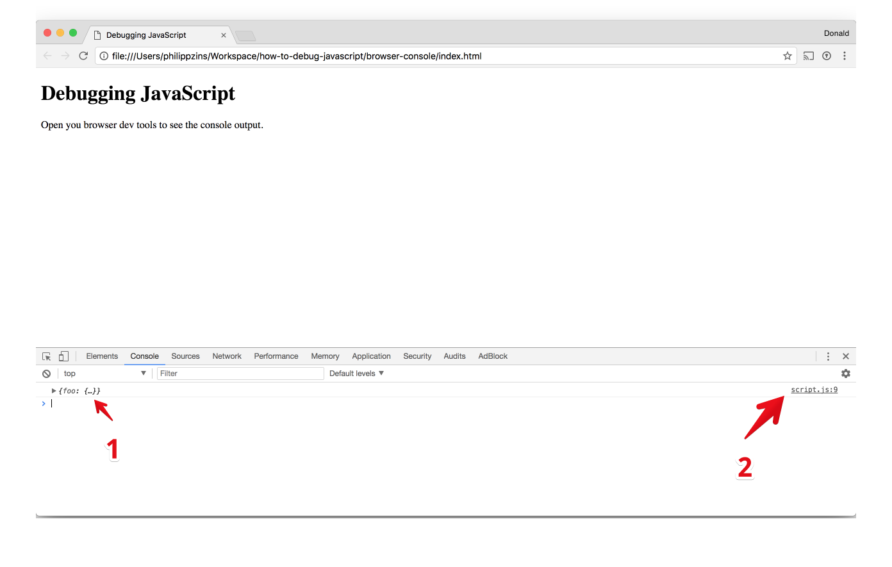
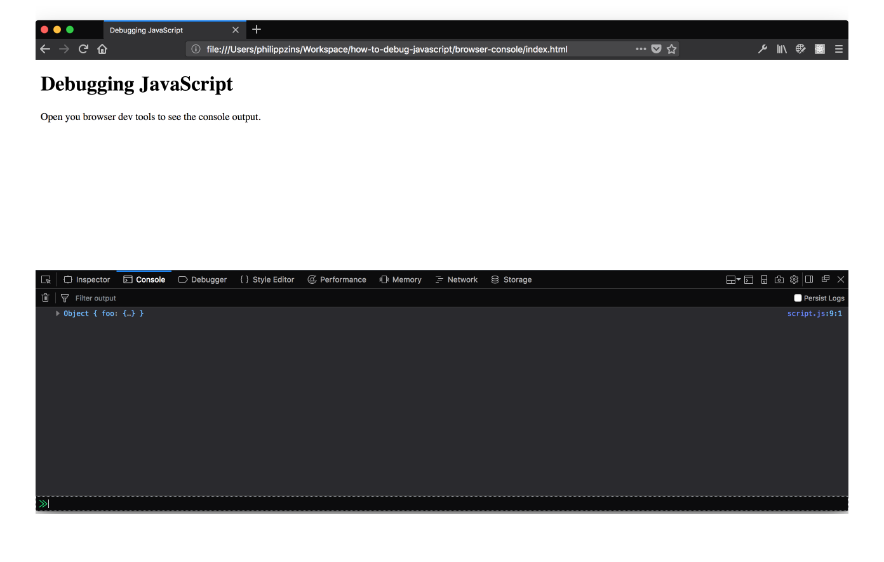
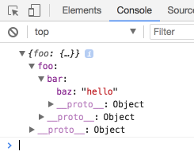
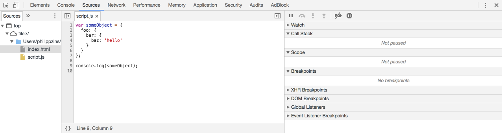

# How to debug JavaScript?

> If you're happy using `console` clap your hands! 👏

I know there are many tutorials about this topic on the internet. However I still get asked this question quite a lot from non JavaScript developers whenever they need to write some JavaScript code: _"How do I actually debug my JavaScript code?"_

I guess they ask, because they found old resources about this topic or they found resources which use a different tooling or they found a tutorial for debugging JavaScript inside the browser, but not Node or... There are probably many reasons. So here is my attempt to answer their question.

In this article you'll get

- a _short_ introduction to debugging JavaScript
- references to more in-depth explanations
- examples for debugging JavaScript in the browser _and_ in Node
- examples with and without tooling<sup>1</sup>

<sup>1</sup> Tooling refers to our setup here at [Mercateo](https://github.com/Mercateo). We use our [`ws` tool](https://github.com/Mercateo/ws) (which uses TypeScript, Babel, Webpack and more) for building our projects and many of our developers use [VS Code](https://code.visualstudio.com/) as their IDE.

You'll **not** get

- a basic introduction to JavaScript itself
- explanations about memory and performance profiling
- explanations about debugging non JavaScript stuff in your application (CSS, HTML, network...)
- explanations about configuring tools (e.g. for source map support)

# Table of contents

1. [Don't fear the `console`](#dont-fear-the-console)
    1. [A simple web project](#a-simple-web-project)
    1. [A more complex web project](#a-more-complex-web-project)
    1. [Web projects with a build setup](#web-projects-with-a-build-setup)
    1. [Logging in a Node project](#logging-in-a-node-project)
1. [Leverage breakpoints](#leverage-breakpoints)
    1. [Breakpoints in a web project](#breakpoints-in-a-web-project)
    1. [Breakpoints in a Node project or projects with a build step](#breakpoints-in-a-node-project-or-projects-with-a-build-step)
1. [Debugging in VC Code](#debugging-in-vs-code)
1. [Advanced topics](#advanced-topics)

# Don't fear the `console`

## A simple web project

Hands down. I use the `console` for 90% of my debugging needs. It just fits my habbits well and most of the time I immediatelly see what's the problem. I don't know why many people feel _bad_ about using the `console` for debugging purposes. Probably because in other programming languages printing to the console lacks a lot of features. Thankfully the console is really powerful in JavaScript - _espacially_ for browser environments.

Let's get started with a very simple example.

```html
<!DOCTYPE html>
<html>
<head>
  <meta charset="utf-8">
  <title>Debugging JavaScript</title>
</head>
<body>
  <h1>Debugging JavaScript</h1>
  <p>Open you browser dev tools to see the console output.</p>
  <script src="./index.js"></script>
</body>
</html>
```

```js
var someObject = {
  foo: {
    bar: {
      baz: 'hello'
    }
  }
};

console.log(someObject);
```

The same example can be found inside [`./browser-console`](./browser-console). Just open in the HTML with a browser of your choice and open the browser console.

💡 All mordern browsers have usually everything you need for basic debugging purposes. But this was not allways the case and some special developer tools are still better in browser _X_ than in browser _Y_. Historically _most_ developers I know use Google Chrome for debugging their applications. But I'd like to point out Firefox which has awesome developer tools as well. Espacially the debugger called [`debugger.html`](https://github.com/devtools-html/debugger.html) itself is nice, because it is a standalone web application written in React.

This is how the browser with the open console looks like in Chrome:



And this is Firefox:



As you can see you get the basic object printed to the console (**1**) and you can see the origin of the output (**2**) as `script-name:row(:column)`. Note that **1** and **2** are _interactive_ elements. (Also note that I'll use screens from Chrome from now on - except when I'd like to point out something special in the Forefox debugger.)

If you click on **1** you can navigate into the object and you can also see properties which we didn't added, because they are on our objects [`prototype`](https://developer.mozilla.org/en-US/docs/Web/JavaScript/Inheritance_and_the_prototype_chain) (in this case just [`__proto__`](https://developer.mozilla.org/en-US/docs/Web/JavaScript/Reference/Global_Objects/Object/proto)).



If you click on **2** you'll jump to the "sources panel" in Chrome or "debugger panel" in Firefox where you can inspect the source code and create breakpoints.



We'll spend more time here in the next chapter. For now let's stick with the console.
